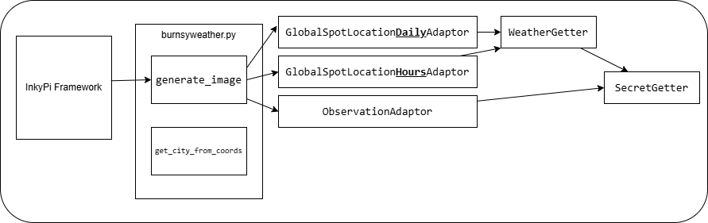

# Running the code with a debugger
Remember to manually attach the debugger.  
`python -m debugpy --listen localhost:8080 src/inkypi.py --dev`

# Code Map


# Classes

## [Observation Adaptor](./../Services/ObservationAdaptor.py)
Note that the ObservationAdaptor is hardcoded to use the (also hardcoded) cached geohash for Southampton to reduce unnecessary calls. The code for getting the location each time is in the class. There may be something that can be done to [persist the value in settings](https://github.com/fatihak/InkyPi/blob/main/docs/building_plugins.md#:~:text=(Optional)%20If%20your%20plugin%20needs%20to%20cache%20or%20store%20data%20across%20refreshes%2C%20you%20can%20manage%20this%20within%20the%20generate_image%20function.).

## [Secrets Getter](./../Services/SecretGetter.py)
Secrets Getter expects something in the format of:
```json
{
	"MetOffice":{
		"APIKey":"",
		"ObservationsAPIKey":""
	}
}
```
`APIKey` - https://datahub.metoffice.gov.uk/docs/f/category/site-specific/overview - Global Spot Data  
`ObservationsAPIKey` - https://datahub.metoffice.gov.uk/docs/o/category/observations/overview

If you want to put secrets outside of the repo, put them in `%APPDATA%\Python\Secrets\InkyPi-Weather\secrets.json"`  

If you change the names of the secrets, change them in:
* [WeatherGetter](./../Services/WeatherGetter.py)
* [ObservationAdaptor](./../Services/ObservationAdaptor.py)
* Here